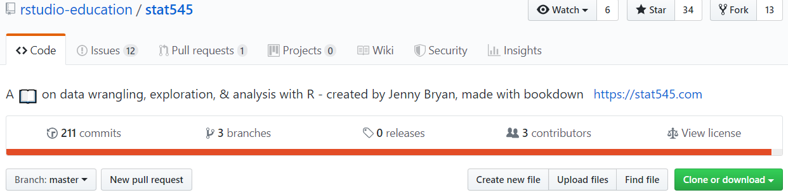
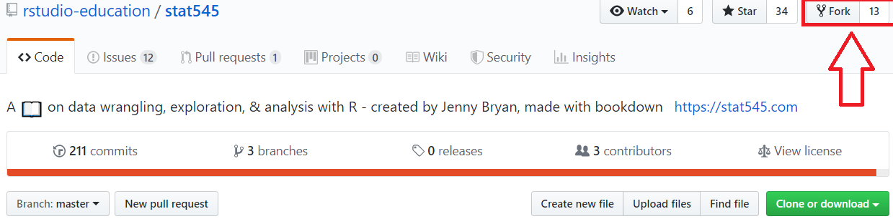
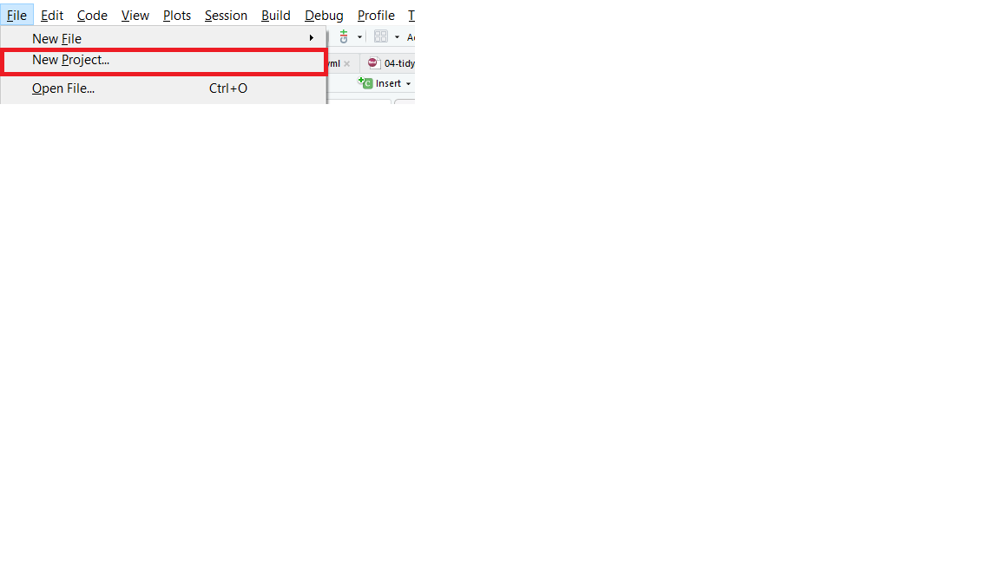
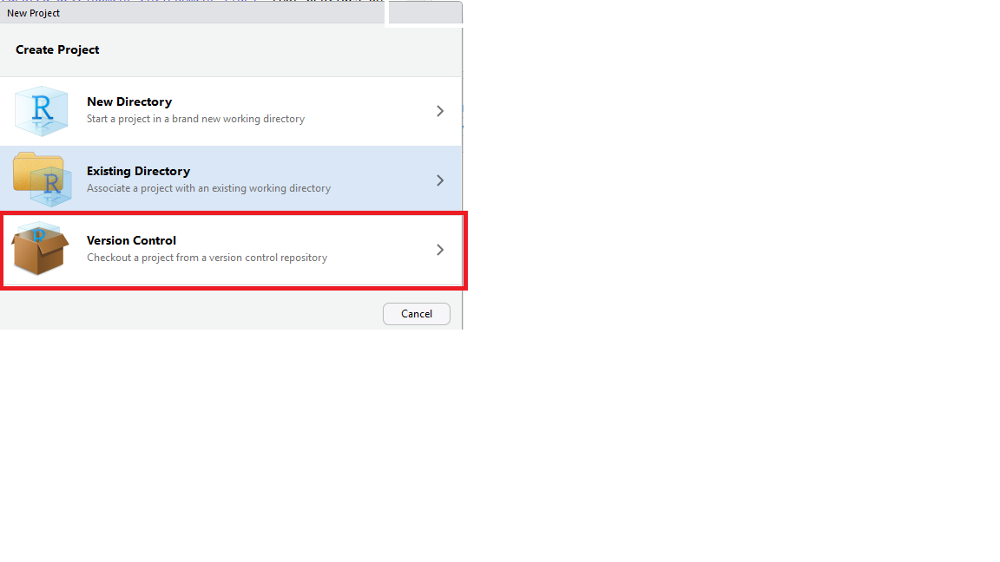
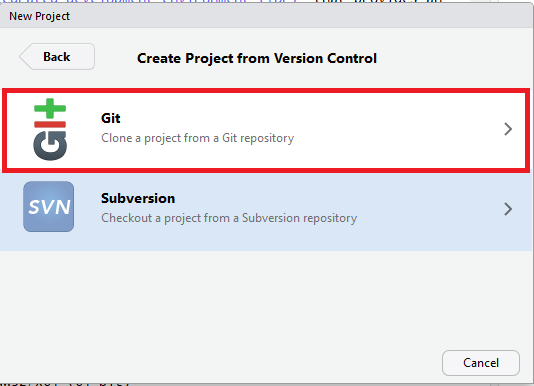
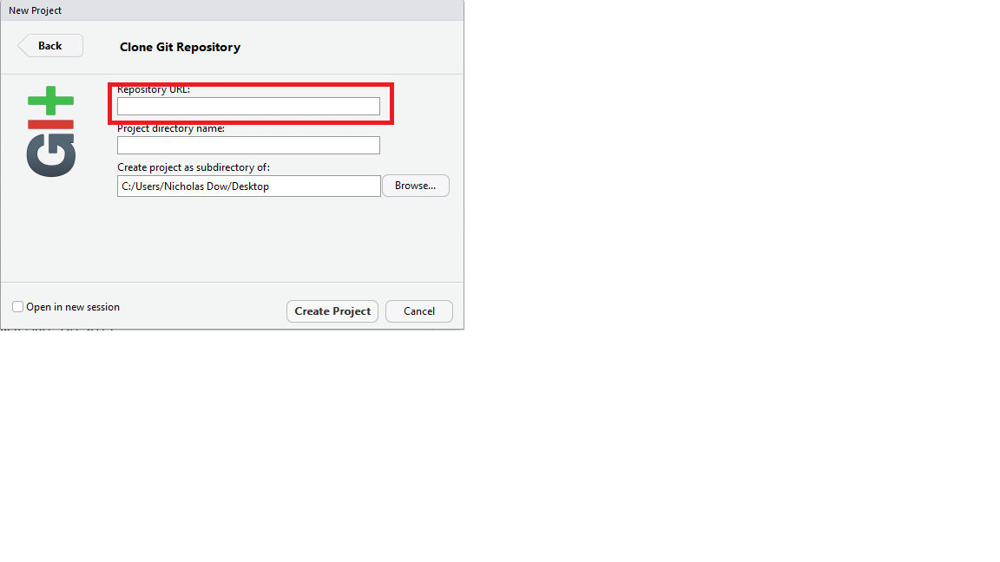

# Introduction

## Github

### Forking the Stat 545 Book
There must be a source for the files, in this case we are going to just copy a specific bookdown book. 
1. Goto the [stat 545](https://github.com/rstudio-education/stat545) page
```{r R-vs-RStudio-1, echo=FALSE, fig.align='center', out.width='95%', purl=FALSE}


```
2.Hit the button in the upper right corner, that says fork
```{r R-vs-RStudio-1, echo=FALSE, fig.align='center', out.width='95%', purl=FALSE}


```
3.Go to your copy of stat 545
4.Hit clone or download
```{r R-vs-RStudio-1, echo=FALSE, fig.align='center', out.width='95%', purl=FALSE}

knitr::include_graphics("images/Github_link.png")
```
5.Go into Rstudio and create a new github project
```{r R-vs-RStudio-1, echo=FALSE, fig.align='center', out.width='95%', purl=FALSE}


```
```{r R-vs-RStudio-1, echo=FALSE, fig.align='center', out.width='95%', purl=FALSE}


```
```{r R-vs-RStudio-1, echo=FALSE, fig.align='center', out.width='95%', purl=FALSE}


```
6.paste the link from your github fork into the Repository URL and hit create project.
```{r R-vs-RStudio-1, echo=FALSE, fig.align='center', out.width='95%', purl=FALSE}


```
7. At the bottom of your screen there should be 