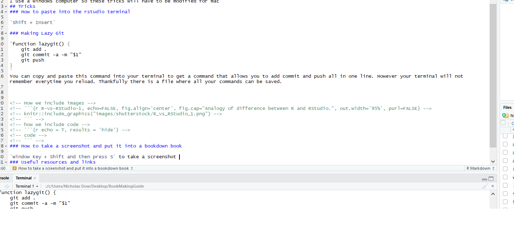

# Tips and Tricks
```{r, echo=FALSE, warning=FALSE}
library(knitr)
```
## Stat 545

you actually need to run `renv::restore()` or else you will have issues in the future

renv.lock has all of teh packages it will install

you need to make a git file with the basic files and explain what every file does
### How to make a kindle version of your bookdown book

first open up the bookdown file you are interested in R studio

download kindlegen: 

depending on whether you have a pc or a mac
the installation of kindlegen to your PATH ( which just means that it can be run from your terminal)

For PC: 

I used something called chocolatey to install programs to my path. I would used this video: https://www.youtube.com/watch?v=KTUO1g_Btfk

once you have that installed, you have to open command prompt as an administrator. What that means is you have to search for command prompt, right click, and select the option to run as administrator.

then type `choco install kindlegen`

For Mac:

you have brew pre installed, which works the same way that choco does. 

open a terminal and type `brew cask install kindlegen`

-----
there is no pc mac difference past this point

in the terminal of R studio  
install bookdown: `install.packages("bookdown")`  
open the library: `library(bookdown)`

This is insane: https://github.com/rstudio/bookdown/issues/440

install webshot and phantomjs:
```
install.packages("webshot")
webshot::install_phantomjs()
```
load all of the libraries you will use in any r markdown file into the console

in your index.rmd add `always_allow_html: yes`
in _output.yml make sure you have a line that says:
`bookdown::epub_book: default`

also go into if you get a files2[[format]] error, (yihui needs to fix this bug) go into _bookdown.yml and delete everything under rmd_files.
if you want to know why look at this: https://github.com/jrnold/bookdown-1/blob/master/R/utils.R

yihui is not clear about this: 
run the command: 
```
render_book("index.Rmd", bookdown::epub_book())
```
then run
```
kindlegen()
```
or use calibre to convert: https://calibre-ebook.com/
 
 
https://rdrr.io/cran/bookdown/man/kindlegen.html

reference: 3.3.2 MOBI of https://bookdown.org/yihui/bookdown/e-books.html
### How to get new lines in markdown

No spaces used   

line1
line2


2spaces at the end of line1  

line1  
line2

As we can see you must type two spaces at the end of the line to get a new line, otherwise it will be continuous


### How to get sub chapter in bookdown

In the markdown file type `##` before the name of your subchapter. `###` give you sub sub chapters.  
`## How to get sub chapter in bookdown` will produce 6.1 How to get sub chapter in bookdown  
`### How to get sub chapter in bookdown` will produce 6.0.1 How to get sub chapter in bookdown  

### How to make new chapters within the same RMD file

When you use a single `#` you will see a new chapter in the book. This is a good way to improve maintainability through github.

### How to paste into the rstudio terminal

`Shift + Insert`


### How to emmbed a link

`[a link](https://i.imgur.com/jwTC9EH.jpg)`: [a link](https://i.imgur.com/jwTC9EH.jpg)

### Making Lazy Git

```
function lazygit() {
    git add .
    git commit -a -m "$1"
    git push
}
```
You can copy and paste this command into your terminal to get a command that allows you to add commit and push all in one line. We can also add this function to your `.bashrc`

I usually try to include a `_lazygit.sh` bash script that contains this code, so you should be able to type `bash _lazygit.sh "some message"` into your terminal to submit easily.

=
### How to take a screenshot and put it into a bookdown book

1. `Window Key + Shift and then press S` to take a screenshot 
2. Open paint and paste into the file
3. Save image into a `~/images` folder inside of the project
4. We type this command into the markdown file code chunk, without the quotation marks around the curly brackets

```
"{r echo=FALSE, fig.align='center', out.width='95%', purl=FALSE}"


```

To produce this picture

```{r R-vs-RStudio-1, echo=FALSE, fig.align='center', out.width='95%', purl=FALSE}

```

### Useful resources and links

- https://github.com/adam-p/markdown-here/wiki/Markdown-Cheatsheet
- https://bookdown.org/yihui/bookdown/#

### Why We Use Travis

It takes a long time for the computer to compile a bookdown book, so we use travis so that that compilation can happen independently on the travis servers. Basically what happens is travis will take your code and the compilation language and run your files in an indpendent enviroment that is displayed through netifly. This is called **continuos integration** and is what the the ci in travis stands for. Travis also lets you check for mistakes via tests, most developers use it for this purpose alone.

You can read about travis more here: [Travis Stackoverflow](https://stackoverflow.com/questions/22587148/trying-to-understand-what-travis-ci-does-and-when-it-should-be-used

### How to comment code in R studio

highlight some code and type `Ctrl + Shift + C` 

### How to reference another chapter

\@ref(how-to-reference-another-chapter)

### Adding Stickers to github

### Things that need to be added in the future
How to make a bookdown book from scratch like this one

A github that has the boiler coat code for a netifly travis. Explain that they use github pages for the default bookdown book


